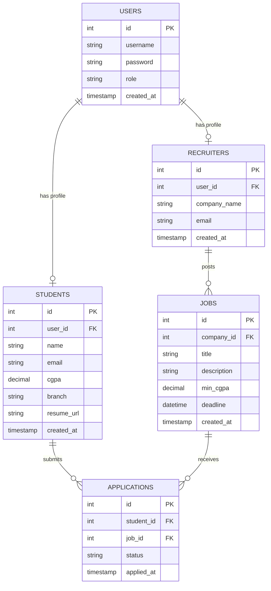

# Student Placement Management System 🎓💼

A modern, full-stack enterprise campus recruitment platform built with high-performance Neumorphic aesthetics, automated CGPA eligibility scanning, in-drawer AI interview preparation, interactive SVG placement analytics, and zero-setup embedded database architecture.

---

## 🚀 Key Highlights & Architectural Features

- **Enterprise SaaS Neumorphic Design System**: Custom architectural UI with dynamic specular highlights, smooth depth elevation, and seamless **Day & Night (Light / Dark) Dual Theme** switching.
- **In-Drawer AI Interview Coach**: Real-time interview intelligence inside the drive inspection drawer, featuring company-tailored technical questions (DSA, System Design, Behavioral) and interactive readiness checklists.
- **Interactive SVG Placement & CTC Analytics**: Pure SVG analytical engine visualizing CTC package distributions (`₹4.5 LPA` to `₹28.4+ LPA`), department clearance rates, and campus conversion funnels with zero third-party chart dependencies.
- **Live Global Notification Center**: Right slide-over notification drawer with categorized recruitment alerts, unread badges, and direct navigation jumps.
- **University-Sealed Placement Dossier**: Printable official student clearance certificate with institutional letterhead, cryptographic verification stamp (`APEX-VRF-2026-X892`), and clean `@media print` formatting.
- **Recruiter Fast-Track Batch Dock**: Multi-select candidate checkboxes across List and Kanban views with floating bulk status updates (`Batch Shortlist`, `Batch Offer`, `Batch Reject`).
- **Zero-Setup Embedded Database**: Powered by Node.js's native `node:sqlite` engine with Write-Ahead Logging (`WAL`), auto-seeding, and seamless toggle to MySQL (`DB_CLIENT=sqlite` or `DB_CLIENT=mysql`).

---

## 🛠️ Technology Stack

- **Frontend:** React 18, React Router v6, Axios, Custom Pure CSS Design System, Web Audio Sound Engine
- **Backend:** Node.js, Express.js, JWT (`jsonwebtoken`), Password Hashing (`bcryptjs`), File Uploads (`multer`)
- **Database:** Native Embedded SQLite Engine (Node.js `DatabaseSync`) + MySQL 8 Pool (`mysql2/promise`)

---

## 🏗️ Architecture & Database Design

### Database ER Diagram



---

## ✨ System Modules

### 🎓 Student Portal
- **Automated CGPA Eligibility Engine:** Dynamically filters campus drives where your academic standing satisfies the cutoff (`student.cgpa >= job.min_cgpa`).
- **AI Interview Coach:** Curated technical question bank tailored to Google, Amazon, Microsoft, and tech partners.
- **Interactive SVG Analytics:** Real-time visual CTC curve and department hiring trends.
- **Printable Placement Dossier:** 1-click printable clearance document for physical campus interview panels.
- **PDF Resume Upload & Inspection:** Upload, verify, and host resumes with static file serving.

### 💼 Recruiter Talent Console
- **Drive Campaign Publisher:** Post placement drives specifying CTC, role details, CGPA cutoffs, and deadlines.
- **Multi-Stage Review Panel:** Dual view modes (Interactive ATS Table and Kanban Pipeline).
- **Batch Operations Action Dock:** Multi-select applicants for bulk shortlisting, interview invitations, or job offers.
- **Instant CSV Export:** 1-click export of candidate rosters with academic standing and contact records.

---

## ⚡ Quick Start Guide

### Prerequisites
- Node.js (v18+)
- *(Optional)* MySQL Server (only required if switching from SQLite to MySQL)

### 1. Installation

```bash
# Clone the repository
git clone https://github.com/shashankdasarii/student-placement-management-system-v2.git
cd student-placement-management-system-v2

# Install backend dependencies
cd backend && npm install

# Install frontend dependencies
cd ../frontend && npm install
```

### 2. Environment Configuration

The backend runs out-of-the-box with the **Embedded SQLite Database** (no setup needed).

Ensure `backend/.env` contains:
```env
PORT=5001
DB_CLIENT=sqlite
JWT_SECRET=super_secret_jwt_key_placement_system_2026
```

*(Optional: To connect to MySQL instead, set `DB_CLIENT=mysql`, `DB_HOST=localhost`, `DB_USER=root`, `DB_PASSWORD=`, and `DB_NAME=placement_db`)*

### 3. Run Locally

**Start Backend Server:**
```bash
cd backend
npm start
# Server runs on http://127.0.0.1:5001
```

**Start Frontend Application (in a new terminal):**
```bash
cd frontend
npm start
# Client opens on http://localhost:3000
```

---

## 🔑 Pre-Configured Test Credentials

| Role | Username | Password | Notes |
| :--- | :--- | :--- | :--- |
| **Student** | `john_student` | `password123` | Pre-configured student profile (CGPA: 8.75) |
| **Student** | `Sasi` | `password123` | Student profile (CGPA: 8.45) |
| **Recruiter** | `techcorp_hr` | `password123` | Recruiter profile for TechCorp Solutions |
| **Recruiter** | `google_recruiter` | `password123` | Recruiter profile for Google |
| **Admin** | `admin_user` | `password123` | System administrator |

---

## 📡 Core API Reference Table

| Module | Method | Endpoint | Access | Description |
|---|---|---|---|---|
| **Health** | `GET` | `/api/health` | Public | Database connectivity & server health check |
| **Auth** | `POST` | `/api/auth/register` | Public | Register student or recruiter account |
| **Auth** | `POST` | `/api/auth/login` | Public | Authenticate user & issue JWT token |
| **Student** | `GET` | `/api/students/profile` | Student | Fetch logged-in student academic dossier |
| **Student** | `POST` | `/api/students/upload-resume` | Student | Upload and verify PDF resume |
| **Jobs** | `GET` | `/api/jobs/eligible` | Student | Fetch CGPA-filtered eligible drives |
| **Jobs** | `GET` | `/api/jobs/recruiter` | Recruiter | Fetch posted drives with applicant metrics |
| **Jobs** | `POST` | `/api/jobs/create` | Recruiter | Publish new institutional recruitment drive |
| **Applications** | `POST` | `/api/applications/apply` | Student | Submit verified application for a drive |
| **Applications** | `GET` | `/api/applications/my` | Student | Fetch student application pipeline status |
| **Applications** | `GET` | `/api/applications/job/:jobId` | Recruiter | Review applicant roster for a drive |
| **Applications** | `PUT` | `/api/applications/:id/status` | Recruiter | Update candidate application stage |
